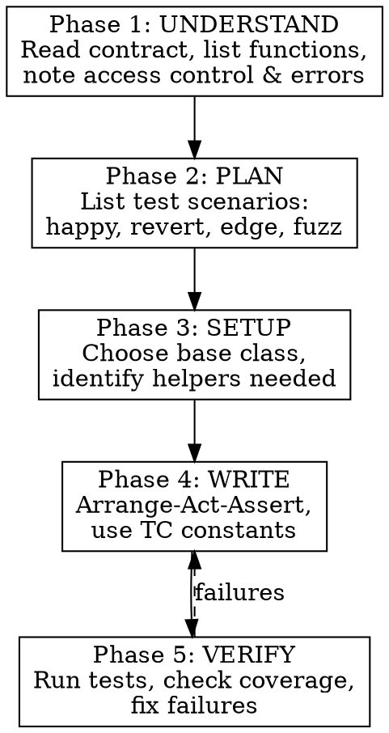

# Foundry Test Writing Workflow

## Overview

Structured workflow for writing comprehensive, production-ready Foundry tests. Ensures complete coverage of happy paths, reverts, edge cases, and fuzz scenarios.

## When to Use

- Writing new tests for a contract or function
- Adding test coverage for uncovered code paths
- Reviewing existing tests for completeness
- Asked to "write tests", "add coverage", "test this"

## Workflow



## Phase 1: UNDERSTAND

Before writing any test, read the target contract:

- [ ] Read contract source completely
- [ ] List all public/external functions
- [ ] Identify state-changing vs view functions
- [ ] Note access control (`restricted`, `onlyOwner`)
- [ ] Review custom errors in `Errors.sol`
- [ ] Check events that should be emitted

**Output:** Function table with type, access, dependencies

## Phase 2: PLAN

For each function, identify test scenarios:

### Happy Path
- Normal successful execution
- Different valid input combinations
- Boundary values that should succeed

### Revert Tests
- Each custom error condition
- Access control violations
- Invalid parameters
- Paused state behavior

### Edge Cases
- Zero values (where valid)
- Maximum values
- Empty arrays/bytes

### Fuzz Candidates
Functions with numeric inputs:
- Amount parameters
- Duration parameters
- Price variations

**Output:** Checklist of test names following conventions:
```
test_FunctionName_Scenario
test_RevertWhen_Condition
testFuzz_FunctionName_Property
```

## Phase 3: SETUP

### Choose Base Class

| Test Type | Base Class |
|-----------|------------|
| Loan tests | `LoanUnitTestBase` or `BaseLoanTest` |
| Vault tests | `UnitTestBase` |
| Fork tests | `ForkTestBase` |
| Integration | `IntegrationTestBase` |

### Identify Helpers Needed

From `LoanUnitTestBase`:
- `_createStandardLoan()`, `_createLoan()`
- `_fundUSDC()`, `_fundCbBTC()`
- `_dropOraclePrice()`, `_setLiquidationType()`
- `_advanceDays()`, `_makeOverdue()`

### File Location

```
test/unit/{ContractName}/{FunctionArea}.t.sol
```

## Phase 4: WRITE

### Template

```solidity
// SPDX-License-Identifier: MIT
pragma solidity 0.8.30;

import {LoanUnitTestBase} from "../../base/LoanUnitTestBase.sol";
import {TestConstants as TC} from "../../helpers/TestConstants.sol";
import {Errors} from "@bitmor/libraries/helpers/Errors.sol";

contract FunctionNameTest is LoanUnitTestBase {

    function test_FunctionName_Scenario() public {
        // Arrange
        address lsa = _createStandardLoan();

        // Act
        vm.prank(user);
        loan.functionName(TC.SOME_CONSTANT);

        // Assert
        assertEq(result, expected, "descriptive message");
    }

    function test_RevertWhen_Condition() public {
        // Arrange
        uint256 invalidValue = TC.MAX_VALUE + 1;

        // Assert + Act
        vm.expectRevert(Errors.SomeError.selector);
        vm.prank(user);
        loan.functionName(invalidValue);
    }

    function testFuzz_FunctionName(uint256 amount) public {
        // Bound inputs
        amount = bound(amount, TC.MIN_AMOUNT, TC.MAX_AMOUNT);

        // Arrange
        _fundUSDC(user, amount);

        // Act
        vm.prank(user);
        loan.functionName(amount);

        // Assert
        assertGe(result, 0, "result should be non-negative");
    }
}
```

### Rules

1. **No magic values** - Use `TC.*` constants
2. **Descriptive assertions** - Always include message string
3. **Specific reverts** - Use error selectors, not generic `expectRevert()`
4. **Arrange-Act-Assert** - Clear separation
5. **One behavior per test** - Don't test multiple things

## Phase 5: VERIFY

### Run Tests

```bash
# Single test file
forge test --match-path test/unit/Loan/NewTest.t.sol -vvv

# Single test function
forge test --match-test test_FunctionName -vvv

# With gas report
forge test --match-contract NewTest --gas-report
```

### Check Coverage

```bash
forge coverage --match-path test/unit/Loan/NewTest.t.sol
```

### Fix Failures

- Read error message carefully
- Check assertion message for context
- Verify mock setup is correct
- Ensure correct base class inheritance

## Quick Reference

### Naming Conventions

| Pattern | Example |
|---------|---------|
| Happy path | `test_InitializeLoan()` |
| Scenario | `test_InitializeLoan_WithMinDeposit()` |
| Revert | `test_RevertWhen_InsufficientDeposit()` |
| Fuzz | `testFuzz_InitializeLoan()` |
| Fork | `testFork_InitializeLoanWithRealAave()` |

### Common Helpers

| Helper | Purpose |
|--------|---------|
| `_createStandardLoan()` | 1 BTC, 12 months |
| `_fundUSDC(addr, amt)` | Mint USDC |
| `_dropOraclePrice(pct)` | Trigger liquidation |
| `_makeOverdue()` | Warp past grace |
| `_setLiquidationType(lsa, type)` | Control liquidation |

### Common Errors

| Symptom | Fix |
|---------|-----|
| "prank consumed" | Cache role ID before `vm.prank()` |
| Mock not returning | Check mock is initialized in setUp |
| Wrong base class | Inherit from `LoanUnitTestBase` for Loan tests |
| Missing approval | Call `_fundUSDC()` which includes approval |
