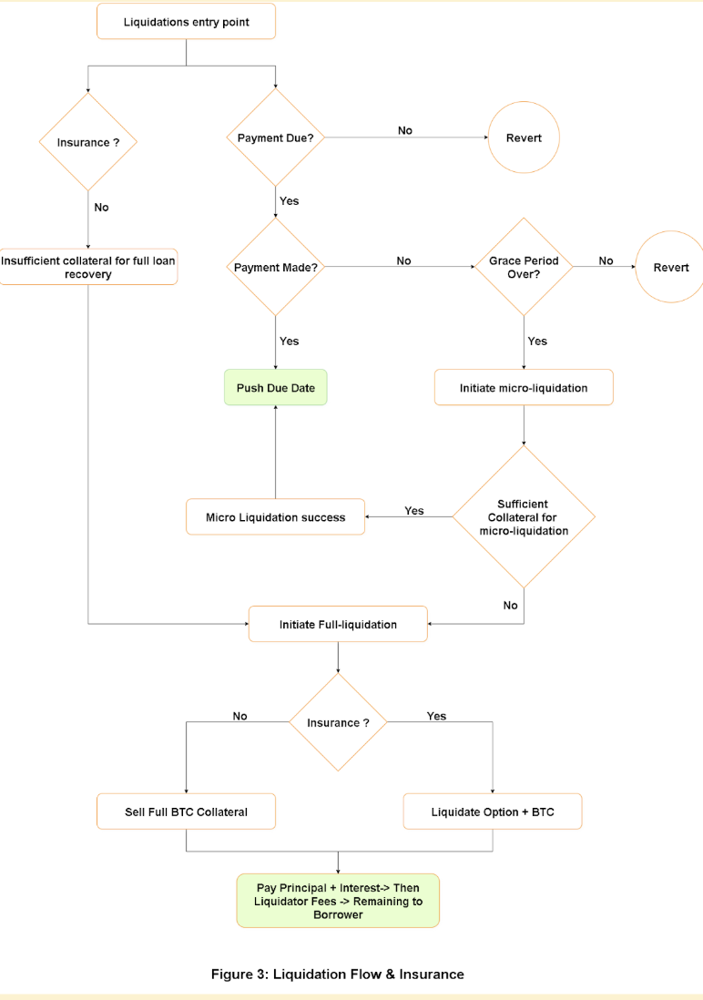

# Bitmor Lending Pool

This repository contains the smart contracts for Bitmor Lending Pool. This repo is a fork of Aave V2, with a custom liquidation mechanism introducing `microLiquidationCall` and custom health-factor management depending on the type of **Loan** user took, i.e., insured or uninsured loan.

The repository uses Docker Compose and Hardhat as development enviroment for compilation, testing and deployment tasks.

## New Features with respect to AAVE V2

### Micro Liquidation Call

When a liquidator initializes a `microLiquidationCall`, if the checks passes, then its sell user's collateral just enough to get them again in the good health factor and to pay the liquidation bonus. The doesn't liquidates user's complete position and maintain healthy protocol economics.

### Full Liquidation Call 

When a liquidator intializes a `liquidationCall`, if the check passess, then its does the liquidation same as how it works in AAVE v2. The primary change is in the checks which contains `isInsured` params, if `true`, then full liquidation will be disabled to prevent user from being liquidated due to price drop.

### Check Type of Liquidation 

Both liquidation calls, needs to call `checkTypeOfLiquidation` which returns a `unit256`. 
If return value:
  - 0: No Liquidation
  - 1: Full Liquidation
  - 2: Micro Liquidaion

This function checks the following conditions of a particular user and based on that returns. The following is the flow diagram for finalizing type of liquidation:



## Setup

The repository uses Docker Compose to manage sensitive keys and load the configuration. Prior any action like test or deploy, you must run `docker-compose up` to start the `contracts-env` container, and then connect to the container console via `docker-compose exec contracts-env bash`.

Follow the next steps to setup the repository:

- Install `docker` and `docker-compose`
- Create an enviroment file named `.env` and fill the next enviroment variables

```
# Mnemonic, only first address will be used
MNEMONIC=""

# Add Alchemy or Infura provider keys, alchemy takes preference at the config level
ALCHEMY_KEY=""
INFURA_KEY=""


# Optional Etherscan key, for automatize the verification of the contracts at Etherscan
ETHERSCAN_KEY=""

# Optional, if you plan to use Tenderly scripts
TENDERLY_PROJECT=""
TENDERLY_USERNAME=""

```

## Markets configuration

The configurations related with the Aave Markets are located at `markets` directory. You can follow the `IAaveConfiguration` interface to create new Markets configuration or extend the current Aave configuration.

Each market should have his own Market configuration file, and their own set of deployment tasks, using the Aave market config and tasks as a reference.

## Test

You can run the full test suite with the following commands:

```
# In one terminal
docker-compose up

# Open another tab or terminal
docker-compose exec contracts-env bash

# A new Bash terminal is prompted, connected to the container
npm run test
```

## Deployments

For deploying Aave Protocol V2, you can use the available scripts located at `package.json`. For a complete list, run `npm run` to see all the tasks.

### Kovan deployment

```
# In one terminal
docker-compose up

# Open another tab or terminal
docker-compose exec contracts-env bash

# A new Bash terminal is prompted, connected to the container
npm run aave:kovan:full:migration
```

### Mainnet fork deployment

You can deploy Aave Protocol v2 in a forked Mainnet chain using Hardhat built-in fork feature:

```
docker-compose run contracts-env npm run aave:fork:main
```

### Deploy Aave into a Mainnet Fork via console

You can deploy Aave into the Hardhat console in fork mode, to interact with the protocol inside the fork or for testing purposes.

Run the console in Mainnet fork mode:

```
docker-compose run contracts-env npm run console:fork
```

At the Hardhat console, interact with the Aave protocol in Mainnet fork mode:

```
// Deploy the Aave protocol in fork mode
await run('aave:mainnet')

// Or your custom Hardhat task
await run('your-custom-task');

// After you initialize the HRE via 'set-DRE' task, you can import any TS/JS file
run('set-DRE');

// Import contract getters to retrieve an Ethers.js Contract instance
const contractGetters = require('./helpers/contracts-getters'); // Import a TS/JS file

// Lending pool instance
const lendingPool = await contractGetters.getLendingPool("LendingPool address from 'aave:mainnet' task");

// You can impersonate any Ethereum address
await network.provider.request({ method: "hardhat_impersonateAccount",  params: ["0xb1adceddb2941033a090dd166a462fe1c2029484"]});

const signer = await ethers.provider.getSigner("0xb1adceddb2941033a090dd166a462fe1c2029484")

// ERC20 token DAI Mainnet instance
const DAI = await contractGetters.getIErc20Detailed("0x6B175474E89094C44Da98b954EedeAC495271d0F");

// Approve 100 DAI to LendingPool address
await DAI.connect(signer).approve(lendingPool.address, ethers.utils.parseUnits('100'));

// Deposit 100 DAI
await lendingPool.connect(signer).deposit(DAI.address, ethers.utils.parseUnits('100'), await signer.getAddress(), '0');

```

## Interact with Aave in Mainnet via console

You can interact with Aave at Mainnet network using the Hardhat console, in the scenario where the frontend is down or you want to interact directly. You can check the deployed addresses at https://docs.aave.com/developers/deployed-contracts.

Run the Hardhat console pointing to the Mainnet network:

```
docker-compose run contracts-env npx hardhat --network main console
```

At the Hardhat console, you can interact with the protocol:

```
// Load the HRE into helpers to access signers
run("set-DRE")

// Import getters to instance any Aave contract
const contractGetters = require('./helpers/contracts-getters');

// Load the first signer
const signer = await contractGetters.getFirstSigner();

// Lending pool instance
const lendingPool = await contractGetters.getLendingPool("0x7d2768dE32b0b80b7a3454c06BdAc94A69DDc7A9");

// ERC20 token DAI Mainnet instance
const DAI = await contractGetters.getIErc20Detailed("0x6B175474E89094C44Da98b954EedeAC495271d0F");

// Approve 100 DAI to LendingPool address
await DAI.connect(signer).approve(lendingPool.address, ethers.utils.parseUnits('100'));

// Deposit 100 DAI
await lendingPool.connect(signer).deposit(DAI.address, ethers.utils.parseUnits('100'), await signer.getAddress(), '0');
```
