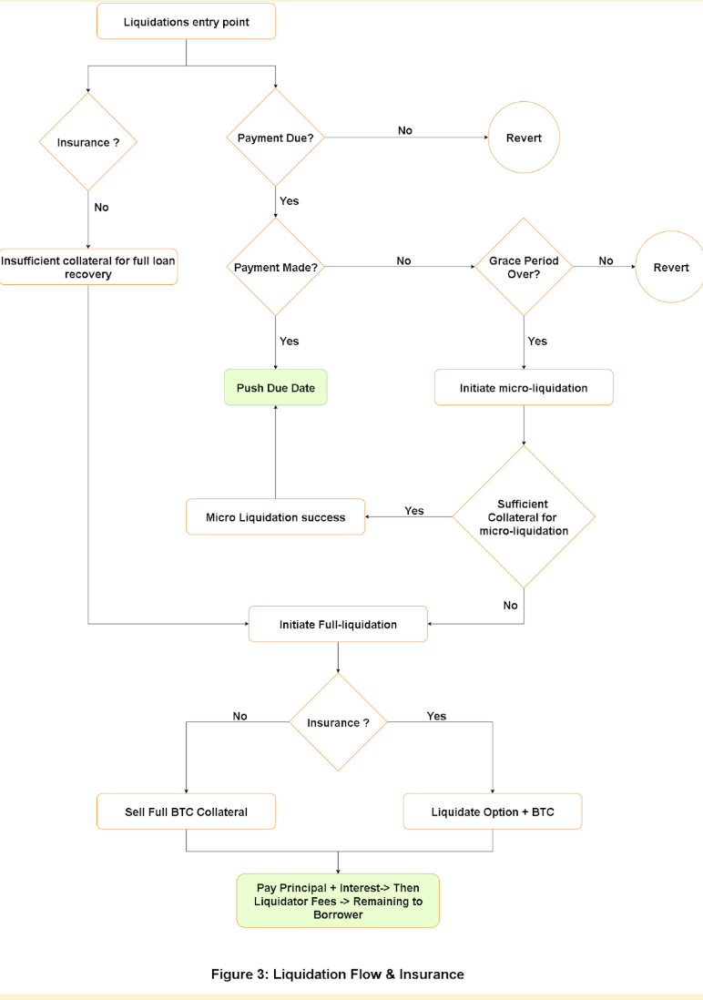

# Bitmor Lending Pool

This repository contains the smart contracts for Bitmor Lending Pool. This repo is a fork of Aave V2, with a custom liquidation mechanism introducing `microLiquidationCall` and custom health-factor management depending on the type of **Loan** user took, i.e., insured or uninsured loan.

The repository uses Hardhat and TypeScript as the development environment for compilation, testing, and deployment tasks.

## Setup & Commands

```bash
# Install
npm install

# Build
npm run compile

# Test
npm test                          # All Aave + Bitmor tests
npm run test-bitmor               # Bitmor-specific tests only
npm run test-scenarios            # Protocol scenario tests

# Single test file
TS_NODE_TRANSPILE_ONLY=1 npx hardhat test ./test-suites/test-aave/<file>.spec.ts

# Deploy
npm run aave:baseSepolia:full:migration   # Base Sepolia
npm run bitmor:localhost:dev:migration    # Local (used by make deploy-local)

# Format
npm run prettier:write
```

## Environment

```
lending-pool/.env:
  MNEMONIC=""        # Deployment wallet mnemonic
  ALCHEMY_KEY=""     # RPC provider
  ETHERSCAN_KEY=""   # Contract verification
```

## New Features with respect to AAVE V2

### Micro Liquidation Call

When a liquidator initializes a `microLiquidationCall`, if the check passes, then it sells just enough of the user's collateral to get them back into a good health factor and to pay the liquidation bonus. This does not liquidate the user's complete position and maintains healthy protocol economics.

### Full Liquidation Call

When a liquidator initializes a `liquidationCall`, if the check passes, then it does the liquidation the same as how it works in AAVE v2. The primary change is in the checks which contain the `isInsured` param; if `true`, then full liquidation will be disabled to prevent the user from being liquidated due to a price drop.

### Check Type of Liquidation

Both liquidation calls need to call `checkTypeOfLiquidation` which returns a `uint256`.
If return value:
  - 0: No Liquidation
  - 1: Full Liquidation
  - 2: Micro Liquidation

This function checks the following conditions of a particular user and based on that returns. The following is the flow diagram for finalizing type of liquidation:


## Integration with loan-provider

- After deployment, this module exports addresses to `deployed-contracts.json` (keyed by network). Key contracts: `LendingPool`, `LendingPoolCollateralManager`, `AaveOracle`, `USDC`, `bcbBTC`.
- The `loan-provider` module reads `LendingPool` and `AaveOracle` addresses from that file via `HelperConfig.s.sol` (`getBitmorPool()`, `getOracle()`).
- This module uses Solidity 0.6.12 (Hardhat); `loan-provider` uses Solidity 0.8.30 (Foundry). The interaction between them is interface-only — `loan-provider` defines its own interface (`ILendingPool`) and communicates through ABI boundaries only.

---
